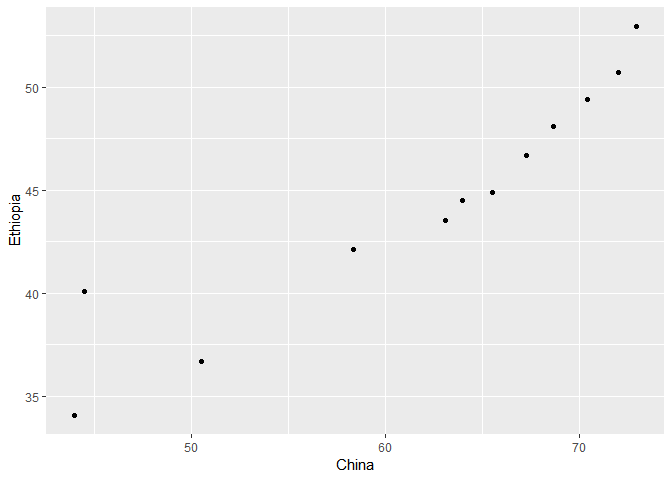

hw04
================

``` r
knitr::opts_chunk$set(echo = TRUE)
```

``` r
library(tidyverse)
```

    ## -- Attaching packages --------------------------------------------------------- tidyverse 1.2.1 --

    ## v ggplot2 3.0.0     v purrr   0.2.5
    ## v tibble  1.4.2     v dplyr   0.7.6
    ## v tidyr   0.8.1     v stringr 1.3.1
    ## v readr   1.1.1     v forcats 0.3.0

    ## -- Conflicts ------------------------------------------------------------ tidyverse_conflicts() --
    ## x dplyr::filter() masks stats::filter()
    ## x dplyr::lag()    masks stats::lag()

``` r
library(gapminder)
library(dplyr)
```

First I will select the data that I am interested in. I will look at
lifeExp by year for Canada, China, and Ethiopia.

``` r
print(gapminder)
```

    ## # A tibble: 1,704 x 6
    ##    country     continent  year lifeExp      pop gdpPercap
    ##    <fct>       <fct>     <int>   <dbl>    <int>     <dbl>
    ##  1 Afghanistan Asia       1952    28.8  8425333      779.
    ##  2 Afghanistan Asia       1957    30.3  9240934      821.
    ##  3 Afghanistan Asia       1962    32.0 10267083      853.
    ##  4 Afghanistan Asia       1967    34.0 11537966      836.
    ##  5 Afghanistan Asia       1972    36.1 13079460      740.
    ##  6 Afghanistan Asia       1977    38.4 14880372      786.
    ##  7 Afghanistan Asia       1982    39.9 12881816      978.
    ##  8 Afghanistan Asia       1987    40.8 13867957      852.
    ##  9 Afghanistan Asia       1992    41.7 16317921      649.
    ## 10 Afghanistan Asia       1997    41.8 22227415      635.
    ## # ... with 1,694 more rows

Next i will filter the data to create the data frame

``` r
dat <- gapminder %>% 
select(year, lifeExp, country) %>% 
  filter(country %in% c("Canada", "China", "Ethiopia"))

dat 
```

    ## # A tibble: 36 x 3
    ##     year lifeExp country
    ##    <int>   <dbl> <fct>  
    ##  1  1952    68.8 Canada 
    ##  2  1957    70.0 Canada 
    ##  3  1962    71.3 Canada 
    ##  4  1967    72.1 Canada 
    ##  5  1972    72.9 Canada 
    ##  6  1977    74.2 Canada 
    ##  7  1982    75.8 Canada 
    ##  8  1987    76.9 Canada 
    ##  9  1992    78.0 Canada 
    ## 10  1997    78.6 Canada 
    ## # ... with 26 more rows

now i will reshape

``` r
tidy_dat <- dat %>% 
  spread(country, lifeExp)
```

Now that I have my data table I will try some scatter plots to compare
the lifeExp of different countries

``` r
library(ggplot2)

tidy_dat %>% 
  ggplot(aes(China, Canada)) + 
  geom_point()
```

<!-- -->

``` r
tidy_dat %>% 
  ggplot(aes(China, Ethiopia)) + 
  geom_point()
```

<!-- -->

``` r
tidy_dat %>% 
  ggplot(aes(Canada, Ethiopia)) + 
  geom_point()
```

<!-- --> I will now
create a cheat sheet similar to Jenny Bryan’s but using TV shows and
genres.

First I will create my two datasets using the tribble function.

``` r
actors <- tribble(
~Actor, ~Show, ~Genre, ~like, 
"Jennifer Anistion", "Friends", "Sitcom", "Like",
"Mandy Moore", "This is Us", "Drama", "Like",
"Blake Lively", "Gossip Girl","Drama", "Dislike",
"Ed O'Neill", "Modern Family", "Sitcom", "Like",
"Meghan Markle", "Suits", "Drama","Like",
)

actors
```

    ## # A tibble: 5 x 4
    ##   Actor             Show          Genre  like   
    ##   <chr>             <chr>         <chr>  <chr>  
    ## 1 Jennifer Anistion Friends       Sitcom Like   
    ## 2 Mandy Moore       This is Us    Drama  Like   
    ## 3 Blake Lively      Gossip Girl   Drama  Dislike
    ## 4 Ed O'Neill        Modern Family Sitcom Like   
    ## 5 Meghan Markle     Suits         Drama  Like

``` r
networks <- tribble(
~Network, ~Show,
"NBC","Friends",
"NBC","This is Us",
"USA", "Modern Family",
"USA", "Suits",
"CBS", "2 and a half men",
)

networks
```

    ## # A tibble: 5 x 2
    ##   Network Show            
    ##   <chr>   <chr>           
    ## 1 NBC     Friends         
    ## 2 NBC     This is Us      
    ## 3 USA     Modern Family   
    ## 4 USA     Suits           
    ## 5 CBS     2 and a half men

``` r
knitr::kable(actors)
```

| Actor             | Show          | Genre  | like    |
| :---------------- | :------------ | :----- | :------ |
| Jennifer Anistion | Friends       | Sitcom | Like    |
| Mandy Moore       | This is Us    | Drama  | Like    |
| Blake Lively      | Gossip Girl   | Drama  | Dislike |
| Ed O’Neill        | Modern Family | Sitcom | Like    |
| Meghan Markle     | Suits         | Drama  | Like    |

``` r
knitr::kable(networks)
```

| Network | Show             |
| :------ | :--------------- |
| NBC     | Friends          |
| NBC     | This is Us       |
| USA     | Modern Family    |
| USA     | Suits            |
| CBS     | 2 and a half men |

The common header between the two datasets is “Show”. I also included
CBS in the networks data set but not the actors data set, and the show
gossip girl in the actors data set but not the networks data set.

Now I will try different ways to join the tables.

``` r
left_join(actors,networks)
```

    ## Joining, by = "Show"

    ## # A tibble: 5 x 5
    ##   Actor             Show          Genre  like    Network
    ##   <chr>             <chr>         <chr>  <chr>   <chr>  
    ## 1 Jennifer Anistion Friends       Sitcom Like    NBC    
    ## 2 Mandy Moore       This is Us    Drama  Like    NBC    
    ## 3 Blake Lively      Gossip Girl   Drama  Dislike <NA>   
    ## 4 Ed O'Neill        Modern Family Sitcom Like    USA    
    ## 5 Meghan Markle     Suits         Drama  Like    USA

This merged the networks data with the actors data, so all actors are
included but there is an NA for Blake Lively because her show is on the
CW which was not included in the network data set.

Now I will join the inverse and see what it looks like.

``` r
left_join(networks,actors)
```

    ## Joining, by = "Show"

    ## # A tibble: 5 x 5
    ##   Network Show             Actor             Genre  like 
    ##   <chr>   <chr>            <chr>             <chr>  <chr>
    ## 1 NBC     Friends          Jennifer Anistion Sitcom Like 
    ## 2 NBC     This is Us       Mandy Moore       Drama  Like 
    ## 3 USA     Modern Family    Ed O'Neill        Sitcom Like 
    ## 4 USA     Suits            Meghan Markle     Drama  Like 
    ## 5 CBS     2 and a half men <NA>              <NA>   <NA>

Now blake lively is missing from the data set as expected. Also, CBS is
now included.

If I right join in the same order, I should get the same results as the
first left join (line 95)

``` r
right_join(networks,actors)
```

    ## Joining, by = "Show"

    ## # A tibble: 5 x 5
    ##   Network Show          Actor             Genre  like   
    ##   <chr>   <chr>         <chr>             <chr>  <chr>  
    ## 1 NBC     Friends       Jennifer Anistion Sitcom Like   
    ## 2 NBC     This is Us    Mandy Moore       Drama  Like   
    ## 3 <NA>    Gossip Girl   Blake Lively      Drama  Dislike
    ## 4 USA     Modern Family Ed O'Neill        Sitcom Like   
    ## 5 USA     Suits         Meghan Markle     Drama  Like

I do see the same results, in a slightly different order of columns.

Now I will try the inner join function

``` r
inner_join(actors,networks)
```

    ## Joining, by = "Show"

    ## # A tibble: 4 x 5
    ##   Actor             Show          Genre  like  Network
    ##   <chr>             <chr>         <chr>  <chr> <chr>  
    ## 1 Jennifer Anistion Friends       Sitcom Like  NBC    
    ## 2 Mandy Moore       This is Us    Drama  Like  NBC    
    ## 3 Ed O'Neill        Modern Family Sitcom Like  USA    
    ## 4 Meghan Markle     Suits         Drama  Like  USA

Now we only see information that is identical in both data sets.

Next I will try semi-join and anti-join.

``` r
semi_join(actors,networks)
```

    ## Joining, by = "Show"

    ## # A tibble: 4 x 4
    ##   Actor             Show          Genre  like 
    ##   <chr>             <chr>         <chr>  <chr>
    ## 1 Jennifer Anistion Friends       Sitcom Like 
    ## 2 Mandy Moore       This is Us    Drama  Like 
    ## 3 Ed O'Neill        Modern Family Sitcom Like 
    ## 4 Meghan Markle     Suits         Drama  Like

this is different from inner join because now network is not included
since there is a difference in this column.

``` r
anti_join(actors,networks)
```

    ## Joining, by = "Show"

    ## # A tibble: 1 x 4
    ##   Actor        Show        Genre like   
    ##   <chr>        <chr>       <chr> <chr>  
    ## 1 Blake Lively Gossip Girl Drama Dislike

``` r
anti_join(networks,actors)
```

    ## Joining, by = "Show"

    ## # A tibble: 1 x 2
    ##   Network Show            
    ##   <chr>   <chr>           
    ## 1 CBS     2 and a half men

Now we see the only difference between the two datasets.

Finally I will do a full join to see ALL of the data

``` r
full_join(actors,networks)
```

    ## Joining, by = "Show"

    ## # A tibble: 6 x 5
    ##   Actor             Show             Genre  like    Network
    ##   <chr>             <chr>            <chr>  <chr>   <chr>  
    ## 1 Jennifer Anistion Friends          Sitcom Like    NBC    
    ## 2 Mandy Moore       This is Us       Drama  Like    NBC    
    ## 3 Blake Lively      Gossip Girl      Drama  Dislike <NA>   
    ## 4 Ed O'Neill        Modern Family    Sitcom Like    USA    
    ## 5 Meghan Markle     Suits            Drama  Like    USA    
    ## 6 <NA>              2 and a half men <NA>   <NA>    CBS

Now I will try to explore some other funtions that are similar to the
join function, such as merge and match.

``` r
merge(actors,networks)
```

    ##            Show             Actor  Genre like Network
    ## 1       Friends Jennifer Anistion Sitcom Like     NBC
    ## 2 Modern Family        Ed O'Neill Sitcom Like     USA
    ## 3         Suits     Meghan Markle  Drama Like     USA
    ## 4    This is Us       Mandy Moore  Drama Like     NBC

This looks similar to an inner join where only the common values are
kept.
